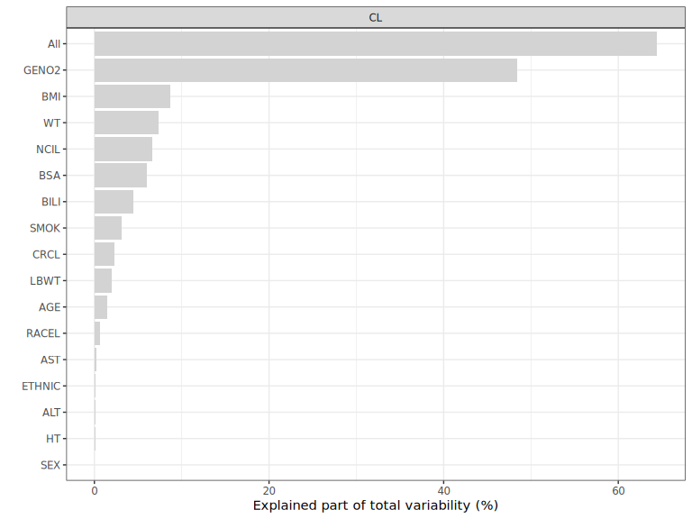

<!-- README.md is generated from README.Rmd. Please edit that file -->

# PMXFrem

The goal of `PMXFrem` is to provide comprehensive post-processing
support for Full Random Effects Models (FREM) built in NONMEM. It
facilitates the automated conversion of FREM models to Full Fixed
Effects Models (FFEM), enabling standard project workflows including
Goodness-of-Fit (GOF) diagnostics, Visual Predictive Checks (VPC), and
forest-plot based results communication.

## Installation

You can install the development version of `PMXFrem` from
[GitHub](https://github.com/) with:

``` r
# install.packages("devtools")
devtools::install_github("pharmetheus/PMXFrem")
```

The vignette sources are in `vignettes/`. Open the `.Rmd` files in
RStudio and click Knit to compile, or run `browseVignettes("PMXFrem")`
to read the versions built at install time.

To get the latest stable release (including vignettes), please click the
appropriate link on the right side of the page. Download the file with a
name that starts with PMXFrem. Install `PMXFrem` with the
`install.packages` command, e.g.:

``` r
install.packages("path_to_release.tar.gz", repos = NULL, type = "source")
```

If your organizational SOPs require installation via an internal package
manager (e.g., Posit Package Manager) or a localized server, please
prioritize those methods over GitHub to ensure environment stability and
reproducibility.

## Example of using PMXFrem

This is a basic example which shows what a converged FREM model gives a
project: an FFEM model to run the usual diagnostics with, a parameter
table, and the share of the parameter variability the covariates
explain.

First attach the PMXFrem library:

``` r
library(PMXFrem)
```

and set the ggplot theme

``` r
ggplot2::theme_set(ggplot2::theme_bw())
```

### Point at the model and the data

Everything below uses the `run31` example bundled with the package, so
it runs anywhere `PMXFrem` is installed. `run31` is a FREM model with 18
covariates, built from the base model `run30`.

``` r
modDevDir <- system.file("extdata", "SimNeb", package = "PMXFrem")
modFile <- file.path(modDevDir, "run31.mod")
extFile <- file.path(modDevDir, "run31.ext")
dataFile <- file.path(modDevDir, "DAT-2-MI-PMX-2-onlyTYPE2-new.csv")
```

A FREM model is described by a handful of structural integers: how many
thetas are structural rather than covariate means, how many etas precede
the FREM block, and so on. `fremModelInfo()` reads them from the model
and its `.ext`, so they do not have to be typed in and kept up to date
as the model changes.

``` r
info <- fremModelInfo(modFile, extFile)
unlist(info[c("numNonFREMThetas", "numFREMThetas", "numParCov", "numSkipOm")])
#> numNonFREMThetas    numFREMThetas        numParCov        numSkipOm 
#>                7               18                3                2
```

The functions below locate the FREM model through `runno` / `modName`
and `modDevDir` and derive the same integers. Supply them explicitly
only to override the derived values.

### Convert the FREM model to its FFEM counterpart

`createFFEMmodel()` writes the FFEM control stream, and the data set
that goes with it, from the FREM model: the covariate coefficients are
computed from the FREM omega matrix and written into the model, so GOF
diagnostics and VPCs can be run in the ordinary way.

``` r
td <- tempdir()

ffemMod <- createFFEMmodel(
  runno = 31,
  baserunno = 30,
  modDevDir = modDevDir,
  dataFile = dataFile,
  parNames = c("CL", "V", "MAT"),
  newDataFile = file.path(td, "ffemData31.csv"),
  ffemModName = file.path(td, "run31_ffem.mod"),
  quiet = TRUE
)

head(ffemMod, 8)
#> [1] ";; 1. Based on: 25"                                                             
#> [2] ";; 2. Description:"                                                             
#> [3] ";;    New simulated data set"                                                   
#> [4] ";; 3. Label:"                                                                   
#> [5] ";;    SimVal base model"                                                        
#> [6] ";------------------------------------------------------------------------------"
#> [7] "$PROBLEM FFEM model"                                                            
#> [8] "$INPUT      NO ID STUDYID TAD TIME DAY AMT RATE ODV DV EVID BLQ DOSE"
```

### Report the parameter estimates

`fremParameterTable()` collects the structural thetas, the
covariate-adjusted variances and the residual error, with uncertainty
from sampled parameter vectors.

``` r
tab <- fremParameterTable(
  runno = 31,
  modDevDir = modDevDir,
  thetaNum = 2:7,
  omegaNum = c(1, 3, 4, 5),
  sigmaNum = 1,
  quiet = TRUE
)

tab$parameterTable
#>     Type   Parameter    Estimate
#> 1  THETA      THETA2   6.1451400
#> 2  THETA      THETA3 122.5250000
#> 3  THETA      THETA4   1.8869400
#> 4  THETA      THETA5   0.6703740
#> 5  THETA      THETA6  -0.0522225
#> 6  THETA      THETA7   0.1211320
#> 7  OMEGA OMEGA1 (SD)   0.2328087
#> 8  OMEGA OMEGA3 (SD)   0.2553093
#> 9  OMEGA OMEGA4 (SD)   0.2281953
#> 10 OMEGA OMEGA5 (SD)   0.2062154
#> 11 SIGMA SIGMA1 (SD)   0.1760429
```

### Describe how the parameters are related to the covariates

The parameter function turns the estimates, one row of covariate values
and a set of etas into the quantities to plot.
`createFREMParamFunction()` writes it by transliterating the FREM
model’s own `$PK`, so the relationship is not retyped in R and cannot
drift away from the model. The result is source text; nothing is
evaluated until you do it yourself.

``` r
gen <- createFREMParamFunction(modFile, parameters = c("CL", "V", "MAT"))
#> Translated $PK of run31.mod for FREM: 3 FREM covariate parameter(s) (CL, V, MAT), 0 returned as-is; numSkipOm = 2, numNonFREMThetas = 7, 1 structural covariate(s).
#>   FOOD reference 1 - reference level of the ";  Most common" branch
```

`verifyFREMParamFunction()` is the check to run before trusting it. It
compares the generated function with the FFEM version of the same
model - an independent transliteration - and confirms that each
parameter’s covariate coefficient and eta land where the model says they
do.

``` r
verifyFREMParamFunction(gen, ffemModel = file.path(modDevDir, "run31max1-2.mod"))
#> verifyFREMParamFunction(): 3/3 parameter(s) pass (tol 1e-06).
#>   CL: pass  (structural 0, cov 0, eta 0)
#>   V: pass  (structural 0, cov 0, eta 0)
#>   MAT: pass  (structural 0, cov 0, eta 0)
```

Read the code against the control stream, then evaluate it:

``` r
paramFunction <- eval(parse(text = gen$code))
```

### Show how much of the variability the covariates explain

`setupDfCovsEV()` builds one row per covariate, and `getExplainedVar()`
computes the total variability of each parameter together with the part
of it each covariate explains. `type = 0` uses the delta rule, which is
the quick way in.

``` r
dfCovs <- setupDfCovsEV(modFile)

dfres <- getExplainedVar(
  type = 0,
  dfCovs = dfCovs,
  cstrCovariates = c("All", names(dfCovs)),
  functionList = list(paramFunction),
  functionListName = c("CL", "V", "MAT"),
  modDevDir = modDevDir,
  runno = 31,
  quiet = TRUE
)

head(dfres, 4)
#>    COVNUM COVNAME PARAMETER   TOTVAR TOTCOVVAR      COVVAR
#> 1       1     All        CL 6.927009  4.465527 4.465526808
#> 4       2     AGE        CL 6.927009  4.465527 0.104963448
#> 7       3     ALT        CL 6.927009  4.465527 0.008084938
#> 10      4     AST        CL 6.927009  4.465527 0.018989224
```

``` r
plotExplainedVar(dfres, parameters = "CL")
```



## Further information

The above is a simple use case of PMXFrem for a straightforward FREM
model. PMXFrem also assembles FREM data sets, extends an established
FREM model with new structural thetas and IIVs, derives subject-specific
variances for missing covariates, and produces the diagnostics and
forest plots a FREM analysis is reported with. These are described in
the package vignettes, which are written to be read in order:

1.  **Quick Start** - a 5-minute copy-pasteable example to verify your
    installation and run a basic FREM-to-FFEM conversion.
2.  **The Walk-Through** - the full workflow, from data assembly to
    forest plot generation.
3.  **The deep dives** - one vignette per topic, for the parts of the
    workflow that need more than the walk-through gives them.

Once the package is installed you can issue the command:
`browseVignettes("PMXFrem")`
